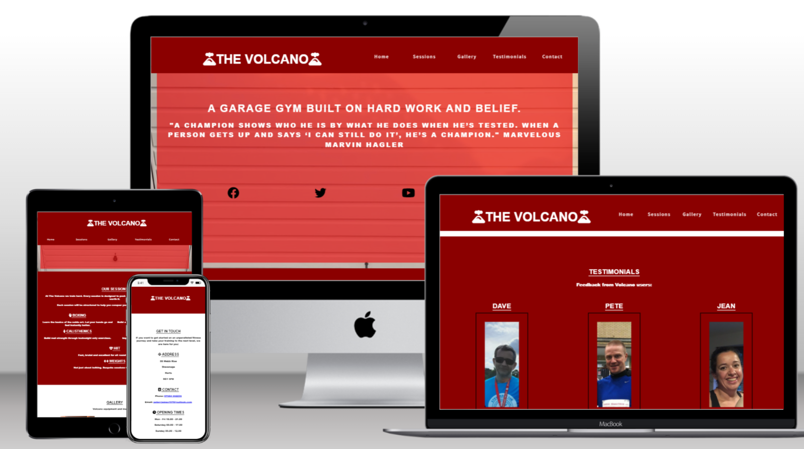
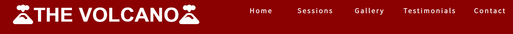
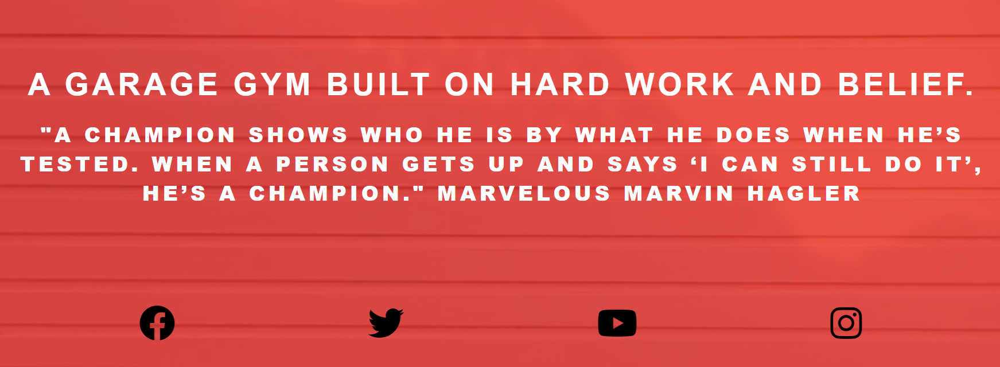
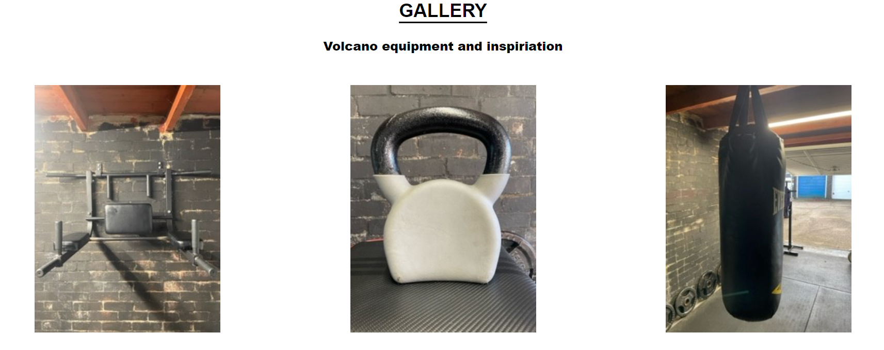
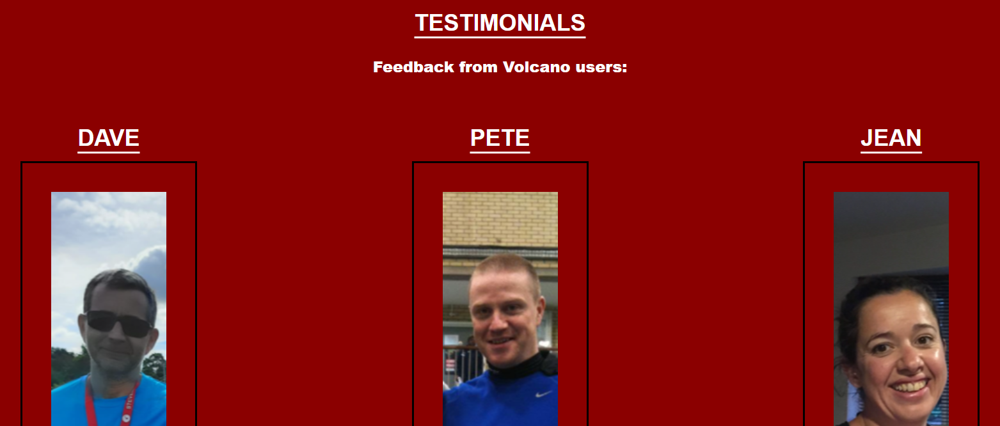
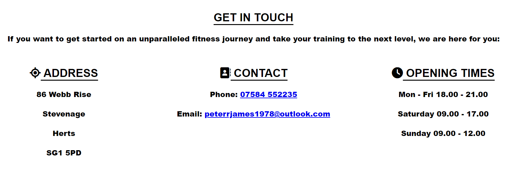
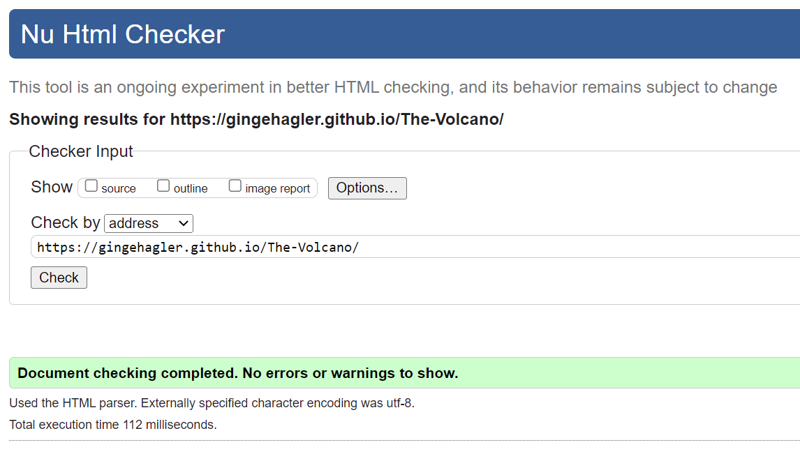

# The Volcano 

The Volcano is a website for a garage gym providing personal training sessions. The gym sessions are aimed at people who want to get fit, strong and train hard. A large inspiration behind the gym is the former middleweight champion boxer Marvelous Marvin Hagler. Site users will find info including opening times, details of what gym sessions can include, contact details and the gym's location. You can view the live site here [The Volcano](https://gingehagler.github.io/The-Volcano/)

 

## Features

* Navigation
    * The Volcano logo is featured in the top left hand corner. The logo is fixed on all size screens as users scroll through the site and links back to the top of the page.  
    * The menu navigation links, Home, Sessions, Gallery, Testimonials and Contact, are positioned to the right hand side of this section and these link to their respective sections on the same page. 
    * As the screen size is reduced the logo and menu links are centred.
* Favicon - A Volcano favicon is featured to provide an image in the the tabs header. This helps users identify the site should they have several tabs open.
* Responsive design

### The Header

* The header shows the gym name and colour and dark red colour background which features in alternate sections of the site. 

### Main Image

* An image of The Volcano garage door is behind a light red background in keeping with the red / lava feel of the site. The gym's description "A garage gym built on hard work and belief" is clear to read and followed by a quote from the inspiration behind the gym, the former undisputed middleweight champion of the world, Marvelous Marvin Hagler. This gives site users an understanding of the ethos behind the gym.
* Links to The Volcano's social media pages Facebook, Twitter, YouTube and Instagram are useful to vistor's of the site as they will take them to the Volcano's social media pages.

### The Sessions Section

* The sessions section continues the theme that training at The Volcano is hard. This helps users understand that this a gym where hard work is essential but it will pay off.
* The sessions section is broken down into 6 areas that the gym specialise in but are not limited to. This gives users the understanding that there are several specific areas of focus within the gym structure but that each session is bespoke to help gym goers achieve their goals.

### The Gallery Section

* The gallery section provides site users with 6 images. 5 images feature equipment to show gym users several examples of apparatus that they will be using when they train at The Volcano. The other image shows a picture of Marvelous Marvin Hagler from one of the gym walls. This serves as a reminder to all users of the standard they are aspiring to reach.

### The Testimonials Section

* The testimonials section contains three positive reviews of The Volcano from gym users. This provides encouraging positive feedback. 

### The Contact Section

* The contact section provides the gym address plus a phone number and email address for anyone to use and get in touch. It also provides the gym's opening hours. 

### Testing
* The site has been tested and works across Chrome, Safari and Edge browsers
* The site has been tested across on all standard screen sizes using devtools. It functions correctly, is easy to view and responsive.
    * Testing Procedure 
    1. Open browser and navigate to The Volcano
    2. Open developer tools by right clicking and selecting 'inspect'
    3. Set to responsive and decrease width to 320px
    4. Set Zoom to 50%
    5. Click and drag responsive window to the maximum width 
*  The phone number and email address within the contact section have been tested to confirm they are clickable working links. 
* Navigation links were tested to ensure all link correctly to their respective pages so the user is always taken to the correct destination. This was done by clicking on the navigation links on each page. All links navigate to the correct pages. 

### Bugs
* Solved Bugs 
    * Social media links were not clickable links when the code was first entered. This was corrected by adding font awesome icons correctly inside the a href link.
    * One gallery image was oversized. Corrected by reinstalling correct sized image. 

### Validator Testing

* HTML
    * No errors were found when passing through the official HTML Validator.

    

* CSS
    * No errors were found when passing through the official CSS Validator (Jigsaw). 

    

* Accessibility 
    * The colours and fonts are accessible and easy to read. This has been confirmed by running through Lighthouse in dev tools. 

### Unfixed Bugs
* No unfixed bugs 

## Deployment

* The site has been deployed using GitHub pages. After creating a repository in GitHub select  'Settings' then 'Pages' then within 'Build and deployment' choose 'Deploy from branch' and select the 'Main' button and 'Save'.     

## Credits

### Content
* I used the code from the Love Running project for my social media links and decided to position them in a different section. All other code is my own. 
* All Icons used are from Font Awesome

### Media 
* All images used in the site were taken by me and uploaded from my personal device. 

