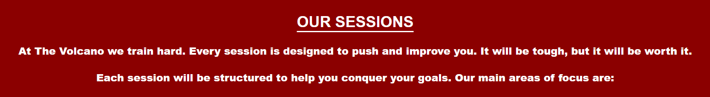

# The Volcano 

The Volcano is a website for a garage gym providing personal training sessions. The gym sessions are aimed at people who want to get fit, strong and train hard. A large inspriration behind the gym is the fomer middleweight champion boxer Marvelous Marvin Hagler. Site users will find info including opening times, details of what gym sessions can include, contact details and the gym's location. You can view the live site here [The Volcano](https://gingehagler.github.io/The-Volcano/)

 

### Features

* Navigation
    * The Volcano logo is featured in the top left hand corner. The logo is fixed on all size screens as users scroll through the site and links back to the top of the page.  
    * The menu navigation links, Home, Sessions, Gallery, Testimonials and Contact, are positioned to the right hand side of this section and these link to their respective sections on the same page. 
    * As the screen size is reduced the logo and menu links are centred.

    

### The Header
* 

### Main Image
* Am image of The Volcano garage door is behind a light red background in keeping with the red / lava feel of the site. The gym's description "A garage gym built on hard work and belief" is clear to read and followed by a quote from the inspiration behind the gym, the former undisputed middleweight champion of the world, Marvelous Marvin Hagler. This gives site users an understanding of the ethos behind the gym.
* Links to The Volcano's social media pages Facebook, Twitter, YouTube and Instagram are ueful to vistors of the site as they will take them to the Volcano's social media pages.

### The Sessions Section
* The sessions section continues the theme that training at The Volcano is hard. This helps users understand that this a gym where hard work is essential but it will pay off.
* The sesisons section is broken down into 6 areas that the gym specialise in but are not limited to. This gives users the understanding that there are several specific areas of focus within the gym structure but that each session is bespoke to help gym goers achieve their goals.

### The Gallery Section
* The gallery section provides siute users with 6 images. 5 images feature equipment to show gym users several examples of apparatus that they will be using when they train at The Volcano. The other image is 

### The Testimonials Section
* The testimonials section contains three positive reviews of The Volcano from gym users. This provides  

### The Contact Section

### Testing
* The site has been tested and works across Chrome, Safari and Edge browsers
* The site has been 

### Bugs
* Social media links were not 

### Validator Testing

* HTML
    * No errors were found when passing through the official HTML Validator.

    

* CSS
    * No errors were found when passing through the official CSS Validator (Jigsaw). 

    

* Accessibility 
    * The colours and fonts are accessible and easy to read. This has been cofirmed by running through Lighthouse in dev tools. 

### Unfixed Bugs
* No unfixed bugs 

Deployment

The site has been deployed using GitHub pages.......
    

## Credits

### Content
* I used the code from the Love Running project for my social media links and decided to position them in a different section. All other code is my own. 
* All Icons used are from Font Awesome

### Media 
* All images used in the site were taken by me and uploaded from my personal device. 

